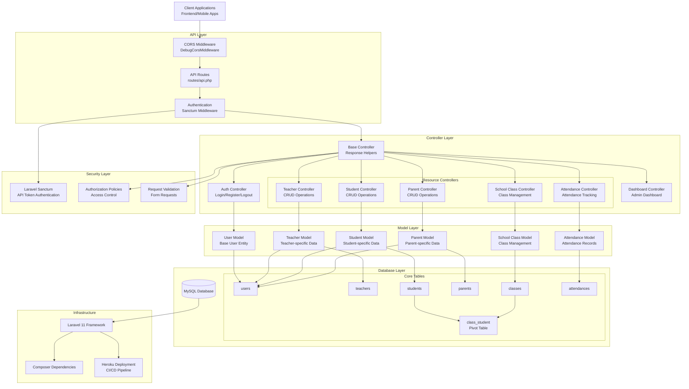
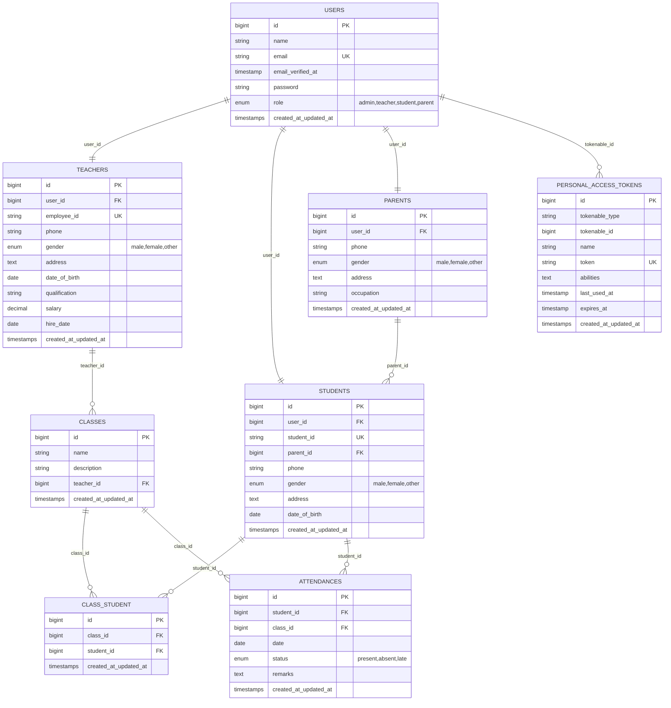
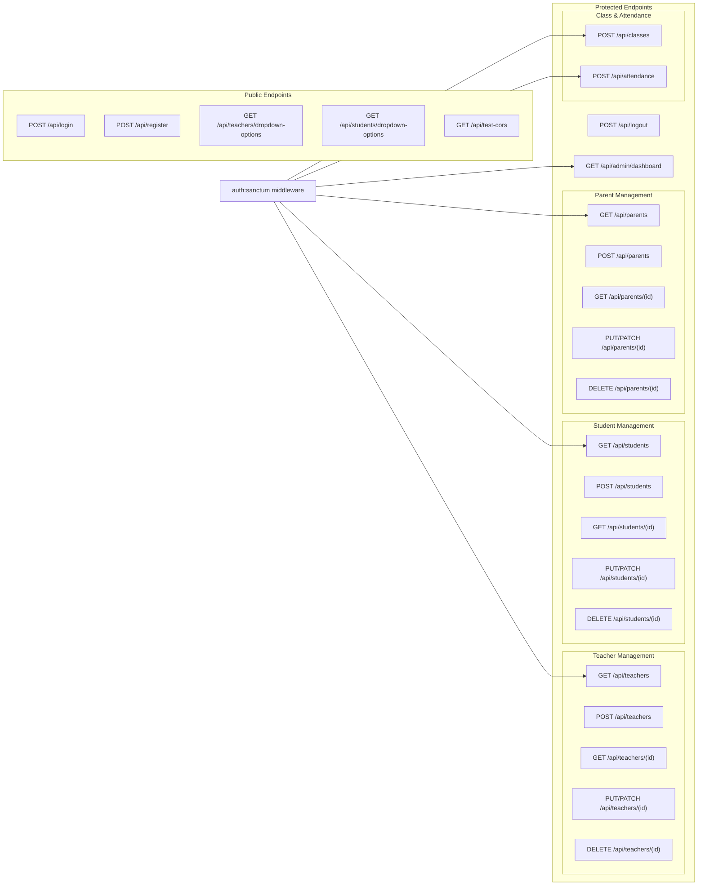

# School Management API - System Architecture Map

## Current System Architecture

## Database Relationship Diagram

## API Endpoint Structure

## Current System Status

### ✅ Implemented Features
- **Authentication System**: Laravel Sanctum with role-based access
- **User Management**: Multi-role user system (admin, teacher, student, parent)
- **CRUD Operations**: Complete resource management for Teachers, Students, Parents
- **Database Relations**: Proper foreign key relationships and pivot tables
- **API Documentation**: Swagger/OpenAPI integration
- **Error Handling**: Structured JSON responses with global exception handling
- **CORS Support**: Cross-origin resource sharing middleware
- **Validation**: Comprehensive form validation with custom messages
- **Route Model Binding**: Automatic model resolution in controllers

### ⚠️ Partially Implemented
- **Class Management**: Basic class creation, needs full CRUD
- **Attendance System**: Basic attendance marking, needs reporting features
- **Dashboard**: Basic admin dashboard, needs comprehensive analytics

### ❌ Missing Features
- **Student Portal**: Dedicated student authentication and dashboard
- **Parent Portal**: Parent-specific features and child monitoring
- **Teacher Portal**: Teacher-specific dashboard and class management
- **Reporting System**: Academic reports, attendance reports, performance analytics
- **Notification System**: Email/SMS notifications for parents and students
- **Grade Management**: Subject grades, report cards, academic performance
- **Timetable Management**: Class schedules and time management
- **Fee Management**: Fee collection, payment tracking
- **Library Management**: Book inventory, borrowing system
- **Exam Management**: Exam scheduling, results management

## Technology Stack

### Backend
- **Framework**: Laravel 11
- **Authentication**: Laravel Sanctum
- **Database**: MySQL
- **API Documentation**: Swagger/OpenAPI
- **Validation**: Laravel Form Requests

### DevOps & Deployment
- **Version Control**: Git
- **Dependency Management**: Composer
- **Deployment**: Heroku with automated CI/CD
- **Environment**: XAMPP (Development)

### Frontend (Not Implemented)
- **Recommended**: React.js/Vue.js/Angular
- **Mobile**: React Native/Flutter (Future consideration)
